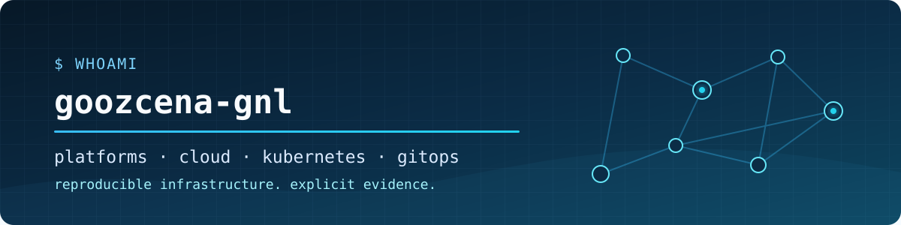

<!-- HERO -->
<p align="center">
  
</p>

<p align="center">
  <strong>Platform Engineering · Cloud · Kubernetes · GitOps · Infrastructure as Code · DevOps/SRE</strong>
</p>

<!-- ABOUT -->
## Engineering platforms from foundations to delivery

I build evidence-backed infrastructure and platform projects around Kubernetes, GitOps, Terraform, Azure, developer experience, and operational automation. The work is designed to be reproducible: each repository records its architecture, trade-offs, validation method, and the boundary between implemented design and runtime evidence.

<!-- CORE DOMAINS -->
### Core engineering domains

`Platform Engineering` · `Kubernetes & GitOps` · `Cloud & Azure` · `Infrastructure as Code` · `CI/CD & Automation` · `Observability & SRE` · `DevSecOps`

<!-- FEATURED PROJECTS -->
## Featured engineering projects

| Project | Engineering case |
|---|---|
| **01 · [Cloud-Native Internal Developer Platform](https://github.com/goozcena-gnl/cloud-native-idp-platform)** | **Problem:** connect developer self-service to governed, observable delivery.<br>**Stack:** Backstage · Kubernetes · Argo CD · OpenTelemetry · Grafana · Kyverno · Vault.<br>**Proof:** [validation model](https://github.com/goozcena-gnl/cloud-native-idp-platform#validation-model) and [indexed evidence](https://github.com/goozcena-gnl/cloud-native-idp-platform/blob/main/docs/EVIDENCE_INDEX.md). |
| **02 · [Azure Data Landing Zone Platform](https://github.com/goozcena-gnl/azure-data-landing-zone-platform)** | **Problem:** establish a governed Azure foundation with secure state and controlled lifecycle operations.<br>**Stack:** Terraform · Azure Policy · Azure networking · Microsoft Entra ID · GitHub Actions/OIDC.<br>**Proof:** [deploy–drift-check–destroy lifecycle record](https://github.com/goozcena-gnl/azure-data-landing-zone-platform/blob/main/docs/validation/2026-07-18-foundation-lifecycle.md) and [test matrix](https://github.com/goozcena-gnl/azure-data-landing-zone-platform/blob/main/docs/validation/test-matrix.md). |
| **03 · [DevOps Automation Toolkit](https://github.com/goozcena-gnl/devops-automation-toolkit)** | **Problem:** turn platform and cloud evidence into safe, deterministic operational reports.<br>**Stack:** Python · Kubernetes · Terraform/OpenTofu · SARIF · JSON Schema · Bash/PowerShell.<br>**Proof:** [20-tool traceability matrix](https://github.com/goozcena-gnl/devops-automation-toolkit/blob/main/docs/validation-matrix.md) and [v1.0.1 release](https://github.com/goozcena-gnl/devops-automation-toolkit/releases/tag/v1.0.1). |
| **04 · [FluxVirt Lab](https://github.com/goozcena-gnl/fluxvirt-lab)** | **Problem:** reconcile virtual machines and containers through one GitOps control plane.<br>**Stack:** K3s · Flux CD · KubeVirt · CDI · Kustomize · Trivy.<br>**Proof:** [dated reconciliation record](https://github.com/goozcena-gnl/fluxvirt-lab/blob/main/VALIDATION.md), [v0.1.0 release](https://github.com/goozcena-gnl/fluxvirt-lab/releases/tag/v0.1.0), and [bounded recovery record](https://github.com/goozcena-gnl/fluxvirt-lab/blob/main/docs/BACKUP-RESTORE.md). |
| **05 · [Flask Kubernetes GitOps Lab](https://github.com/goozcena-gnl/flask-kubernetes-gitops-lab)** | **Problem:** separate artifact production from cluster reconciliation in a hardened delivery path.<br>**Stack:** Flask · GitLab CI · Buildah · Kubernetes · Kustomize · Argo CD · Traefik.<br>**Proof:** [Minikube and Argo CD E2E record](https://github.com/goozcena-gnl/flask-kubernetes-gitops-lab/blob/main/docs/minikube-argocd-e2e.md) and [validation report](https://github.com/goozcena-gnl/flask-kubernetes-gitops-lab/blob/main/docs/validation-report.md). |

<!-- ENGINEERING JOURNEY -->
## Engineering journey

```text
Design the platform → Govern the cloud foundation → Automate operations
        → Explore infrastructure boundaries → Deliver workloads safely
```

> **Evidence boundary:** These are scoped engineering projects, not claims of production adoption. Their documentation distinguishes implemented design, static validation, retained lab or runtime evidence, and paths that were not exercised against live target environments.

<!-- ACTIVITY -->
## Engineering activity

<a href="https://github.com/goozcena-gnl?tab=contributions">
  <picture>
    <source media="(prefers-color-scheme: dark)" srcset="https://raw.githubusercontent.com/goozcena-gnl/goozcena-gnl/output/github-contribution-grid-snake-dark.svg" />
    <source media="(prefers-color-scheme: light)" srcset="https://raw.githubusercontent.com/goozcena-gnl/goozcena-gnl/output/github-contribution-grid-snake.svg" />
    
  </picture>
</a>

<sub>Generated weekly from the public GitHub contribution graph. It does not create, backdate, or modify contribution history.</sub>

<!-- CONTACT -->
## Connect

[GitHub profile](https://github.com/goozcena-gnl) · [All repositories](https://github.com/goozcena-gnl?tab=repositories)
